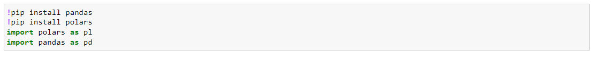
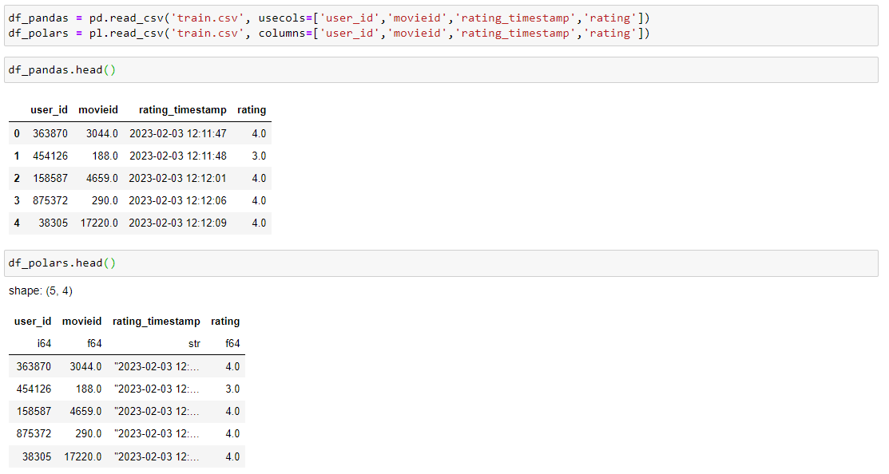
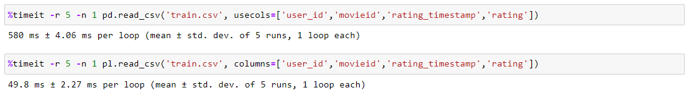
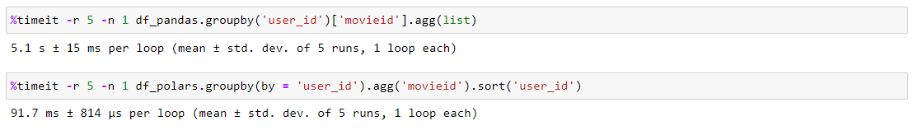
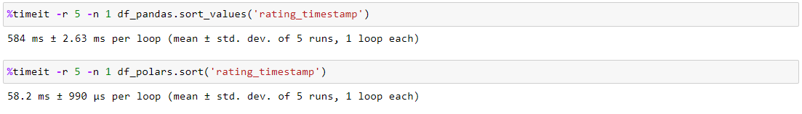
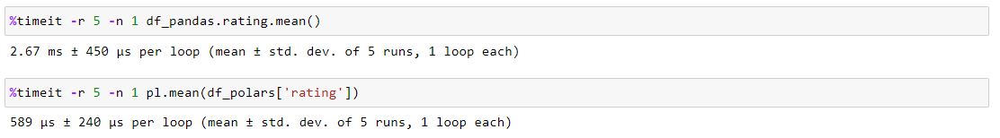

# Polars for Python

## Problems with Current Data Pipelines
Pandas is one of the most popular tools used by data scientists today for data manipulation in Python based pipelines. Pandas Dataframes are easy to use, very flexible, and easy to integrate into other libraries due to its popularity. However, there are a few major drawbacks to Pandas that limits its use in real world production problems:
* Speed: Pandas is single threaded. There have been other solutions that attempt to add parallelization by building on top of Pandas (ie [Dask](https://www.dask.org/)), but these solutions are limited because they do not rebuild the library from the ground up. 
* Scalability: Beyond just the issues with speed, Pandas does not scale to larger problems as it must hold everything in memory. This problem is exacerbated because it uses eager execution (more on this later).

To overcome these limitations, many people use big data solutions like [PySpark](https://spark.apache.org/docs/latest/api/python/#). But these have their own issues as they are often cumbersome to set up, incur additional overhead for distributed backends, and are still relatively slow. 

The primary issue is the lack of solutions that offer a good mix of high performance, scalability for larger datasets in non-distributed workloads, and ease of use. In [these](https://h2oai.github.io/db-benchmark/) results for a benchmark of database-like operations, we see several trends. Most solutions, several of which we have discussed above, are either too slow or do not scale well to larger datasets, or both. One of the few exceptions is Polars.

## Advantages of Polars

[Polars](https://www.pola.rs/) is a Dataframe interface built in Rust for high performance using the Apache Arrow memory model for speed and efficiency. For Python and Pandas users, it also offers a Python API that is lightweight and easy to use. It is built from the ground up for optimized multi-threaded Dataframe operations for significant improvements in speed over Pandas. It also features:
* Lazy/Eager Execution: Polars offers an API for both eager and lazy execution. Eager execution is like Pandas where commands are executed immediately upon being called with immediate results upon completion. Lazy execution is similar to Spark, where commands are queued but not run until a command to return results is called. Lazy execution allows for under-the-hood optimizations that can lead to large improvements in both speed and memory usage, especially for long chains of commands that are commonly used in data piplines. Remember the prior point about Pandas not scaling to larger than memory data and eager execution? This is why that is a problem. Imagine having a large dataset but a significant portion of the data is not going to be used. With Pandas, the entire dataset must first be loaded into memory before any filtering operations can take place. With Polars Lazy API, loading the dataset can be optimized to only load the data that passes the filter criteria.
* Stream querying: When using Polars Lazy, it also allows for queries to be processed in a streaming fashion. This allows for queries to be executed over batches rather than all the data at once. This drastically reduces memory requirements and allows for processing datasets that are larger than memory, but at the cost of some speed. This is also not fully implemented for all lazy operations, but many common operations are supported such as filter, join, and groupby. You can see the full list of supported commands [here](https://pola-rs.github.io/polars-book/user-guide/concepts/streaming/). This is **not** a replacement for big data distributed networks.
* Familiar Syntax: If you're familiar with Pandas or PySpark, the syntax of Polars is extremely similar. If fact, many pre-existing Pandas pipelines can likely be ported with minimal changes. 

We will explore how much faster Polars is over Pandas in several common operations further below in a hand-on demonstration.

## Disadvantages
So we can see that Polars solves many of the problems we discussed in the first section of this blog, but what are its drawbacks?
* Familiar Syntax: This is both a blessing and a curse. While the familiar syntax may lower the initial learning curve, it can also lead to problems because Polars might run code directly ported from Pandas, but in a suboptimal manner. Maximizing performance may require nuanced knowledge of the Polars API and the similarities with Pandas may actually be detrimental.
* Big Data: For problems that require more than one machine, Polars does not provide distributed capabilities. If scaling vertically (getting a bigger machine), Polars works extremely well. But when that is no longer feasible and additional machines need to be added, a disbtributed big data platform like Spark is required.
* Integration: Because Pandas is so common, many other APIs and libraries are well integrated with Pandas Dataframes. This is not true of Polars because it is relatively new. This issue is somewhat mitigated because a Polars Dataframe is easily converted to a Pandas Dataframe or a Numpy ndarray, but for workloads that require Pandas Dataframes consistently throughout the pipeline, Polars may not be a good solution.

## Summary
* Polars is an alternative to Pandas that offers a significant improvement in speed with multi-threading and allows for larger than memory datasets with minimal initial barrier to entry. 
* Polars fills the gap between easy to use, single machine libraries like Pandas and big data platforms like Spark.
* For single machine applications that prioritize speed and don't require many interactions with external APIs, Polars may be a great solution.

# Data Processing Speed Ups Using Movie Logs
The recommender system project used in class is actually a great application for Polars. In this project, each group is given a stream of data through Kakfa providing information on what movies users are watching and ratings data. This raw stream data is then processed into a format suitable for training a machine learning model. This trained model is then deployed as a application as a movie recommender system. Each group is given a VM with 4 vCPUs and 16GB of system memory. 

So why is this a great application for Polars?
* This is a single machine problem. Distributed platforms might allow for multi-threading or multi-processing but come at the cost of significantly increased overhead and setup cost.
* Speed is important. The data cleaning and processing pipeline is not triggered often, but the service may be degraded during this time due to compute constraints. This is a tradeoff we need to design for: Pandas is slow but single-threaded. If we can isolate hardware for this task, it may be reasonable to just use Pandas. However, without isolation, the tradeoff is between how much compute resources are being consumed for the data processing and the time needed to complete the process. Depending how much faster Polars is over Pandas, it may be worth it to let the recommendation service become completely unresponsive for a very short period of time rather than have a degraded but somewhat functional service for a much longer period.

So lets explore how much faster Polars is over Pandas using an example subset of our data from the project. [Here](https://drive.google.com/drive/folders/1L5WDMKdReS68_w2xWKLZtKMxPF6w1I2E?usp=share_link) is the link to the notebook and data we will be using. We will explore the differences in speed using eager execution and a few common operations. For reference, this comparison was completed on my laptop with an Intel i9-12900H CPU.

## Loading both Libraries
Installing and using both Pandas and Polars is extremely simple. 

## Loading Dataset 
Here we load a snippet of our dataset from the project called 'train.csv'. This is a collection of ratings from the Kafka stream with some processing partial already completed. There are 2,485,196 rows and we will be importing 4 columns: 'user_id', 'movieid', 'rating_timestamp', and 'rating'. 

Here is a snippet of what each dataframe looks like. We can see that the syntax for the two libraries are very similar. However, there is a subtle but very significant difference in the actual dataframe images. **Polars does not have row indexing.** This might be quite surprising if you're coming from Pandas, but the developers believe indexing adds needless complexity and introduces more errors for little upside. Frankly, I tend to agree with the Polars developers as I find Pandas indices more troublesome than useful, and often lead me to write poorly optimized code. You can read more about their explanation [here](https://pola-rs.github.io/polars-book/user-guide/migration/pandas/#differences-in-concepts-between-polars-and-pandas). If your Pandas pipeline uses a lot of row-wise indexing operations, you may need significant modifications when switching over to Polars.

Now lets compare how long it took to actually load the data.

We can see an impressive reduction (> 11x faster) in load times. This is likely due to the parallelized nature of Polars along with the performance benefits of Apache Arrow. We can expect this gap to further increase in larger machines with higher core counts, and potentially for larger datasets. 

## Groupby
Here we experiment with a very common operation: the groupby and aggregate. We group by the user_id and aggregate the movieids into a list. I expect to see a signficant improvement in speed because groupby is one of the most expensive operations that can be parallelized, so Polars should have the most room for improvement here.

The results do not disappoint. Polars achieves an over 50x speed up compared to Pandas. One important difference between the two outputs is that Pandas preserves the order of rows, while Polars does not. That is why I added the additional sort operation to the Polars line. 

## Sorting
Let's try another common Dataframe operation: sorting. Here we try a simple sort by rating_timestamp because there may be issues with the order in which the raw data was read processed into the csv. 

Again, Polars achieves a significant (~10x) speed up relative to Pandas with just a minor change to the syntax. 

## Simple Numerics: Mean
For more simple tasks, we can expect the gap to shrink between the two platforms. One example would be a very simple numerical operation like finding the mean of a column. Here we find the mean of the ratings column. Because this is such a fast operation on a small dataset, the additional overhead required for multi-threading may not lead to a signficant improvement in speed. 

I was surprised that the improvement was still substantial (~4x), though the difference was not nearly as large as the previous experiments. This result likely would shift further to Polars favor for a much larger dataset, or for more complex math operations.

## Closing Thoughts
The results were quite staggering. Polars resulted in substantial improvements in the groupby and sorting operations, which are two of the most common and expensive Dataframe operations. For more complex chains of operations, Polars Lazy API would likely provide an even larger difference in speed. However, when doing simple operations, the difference between Pandas and Polars shrinks dramatically. Most importantly, these speed ups were achieved with just a few minor syntax changes, though these changes may be deceptively simple at first.

For many real world applications where the data is likely to be substantially larger, more complex, and requires more sophisticated processing, Polars is a valuable tool that offers impressive performance benefits with robust scaling options without the need for complex distributed systems. I believe that systems like Polars will only grow in importance and popularity as single machine core counts increase. Imagine someone who needs fast data processing on a medium sized dataset (relatively large but still fits on a single machine with an optimized configuration). Pandas is prohibitively slow and too memory inefficient. AWS offers big data services like [EMR](https://aws.amazon.com/emr/), but these are often very cumbersome to configure. [Databricks](https://www.databricks.com/product/aws) is much easier to use, but comes at a signficant cost increase. Furthermore, none of these platforms are particularly fast. An alternative would be to use Polars on a single instance with a high vCPU count without all of the overhead that comes with Hadoop or Spark, and the setup and syntax are all very simple and familar.  
